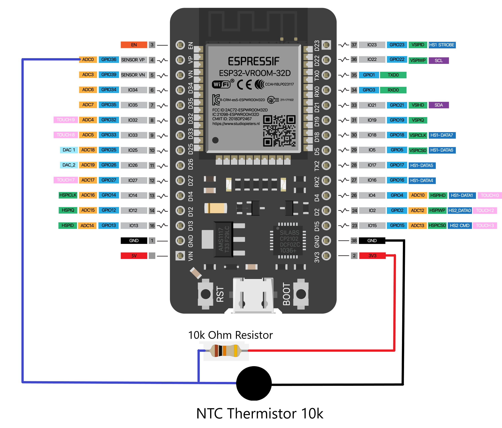

# ESP32 Temperature monitor with AWS IoT Core

Created With [PlatformIO](https://platformio.org/)

## Requirements

Requires AWS IoT Core Thing to be created and certificates added to "keys.h".

Add your WiFi credentials, AWS IoT Core endpoint and settings that match your created policy to "configuration.h".

[PlatformIO](https://platformio.org/) to build and deploy to your device.

## Example IoT Core Policy

```json
{
  "Version": "2012-10-17",
  "Statement": [
    {
      "Effect": "Allow",
      "Action": "iot:Connect",
      "Resource": "arn:aws:iot:region:12345:client/mqttusername"
    },
    {
      "Effect": "Allow",
      "Action": "iot:Publish",
      "Resource": "arn:aws:iot:region:12345:topic/tempmonitor/temperature"
    },
    {
      "Effect": "Allow",
      "Action": "iot:Subscribe",
      "Resource": "arn:aws:iot:region:12345:topicfilter/tempmonitor/*"
    },
    {
      "Effect": "Allow",
      "Action": "iot:Receive",
      "Resource": "arn:aws:iot:region:12345:topic/tempmonitor/cmd"
    }
  ]
}
```

## Example of published message

Messages are formatted to JSON

```json
{ "id": "2T9BEA943123", "temperature": 9.13, "Date": 1639638580 }
```

## Wiring diagram



### ESP32 Linearity issue

To address the ESP32 ADC non-linear issue, a lookup table is used to correct the non-linearity. You may need to generate your own lookup table as it varies from device to device due to the variation of ESP32 internal reference voltage.
[Read More](https://github.com/e-tinkers/esp32-adc-calibrate)
